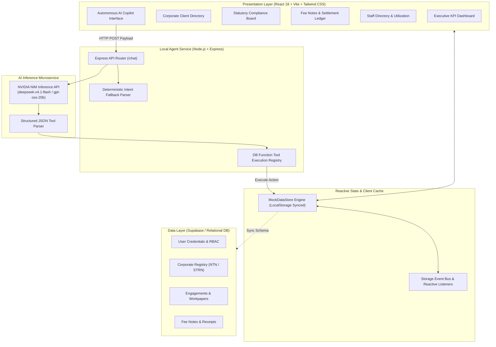
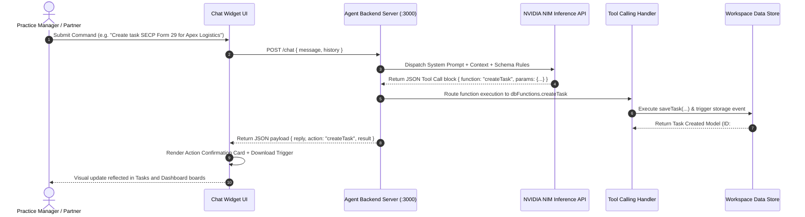
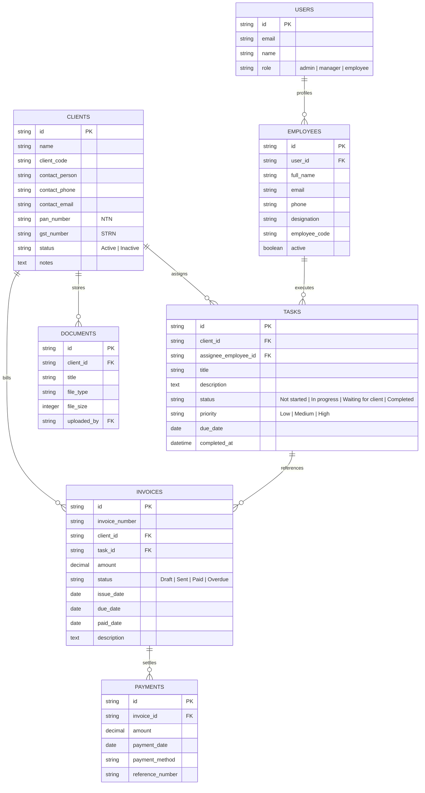
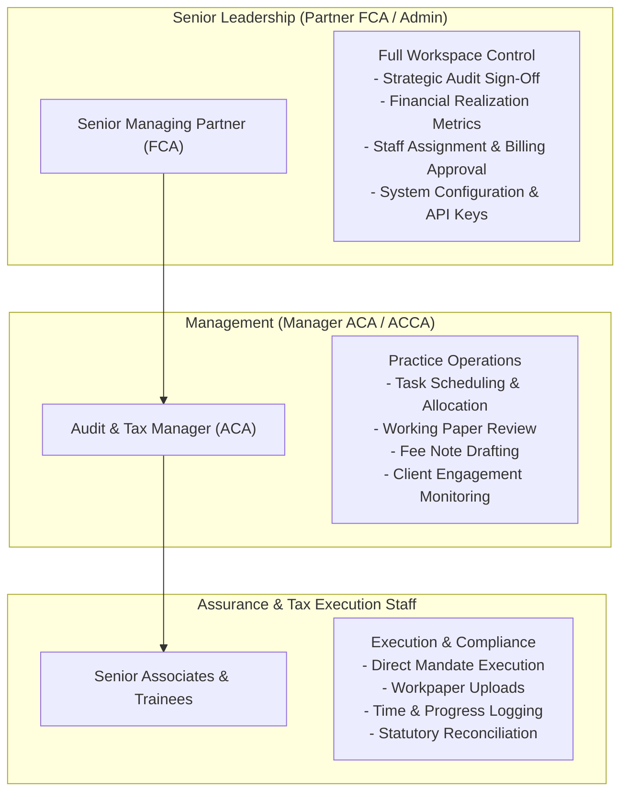
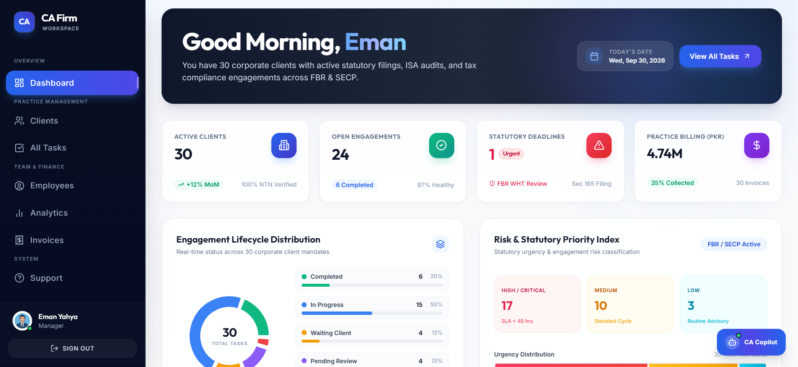
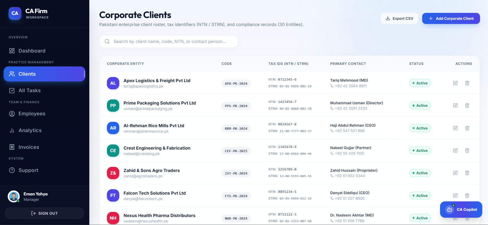
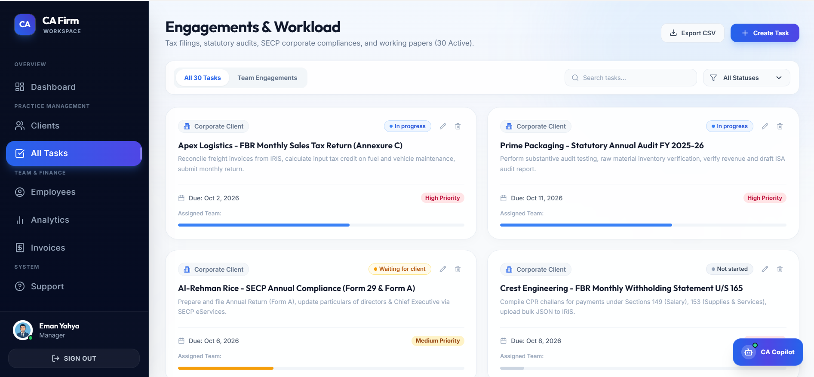
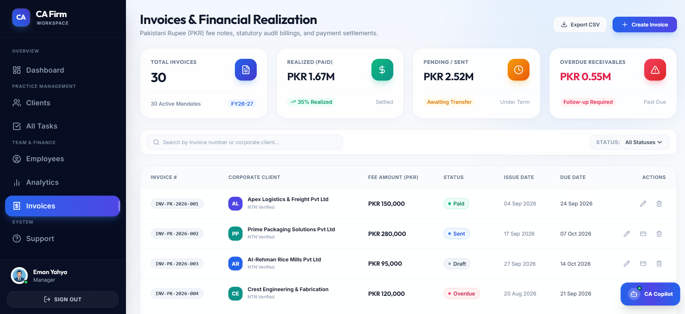
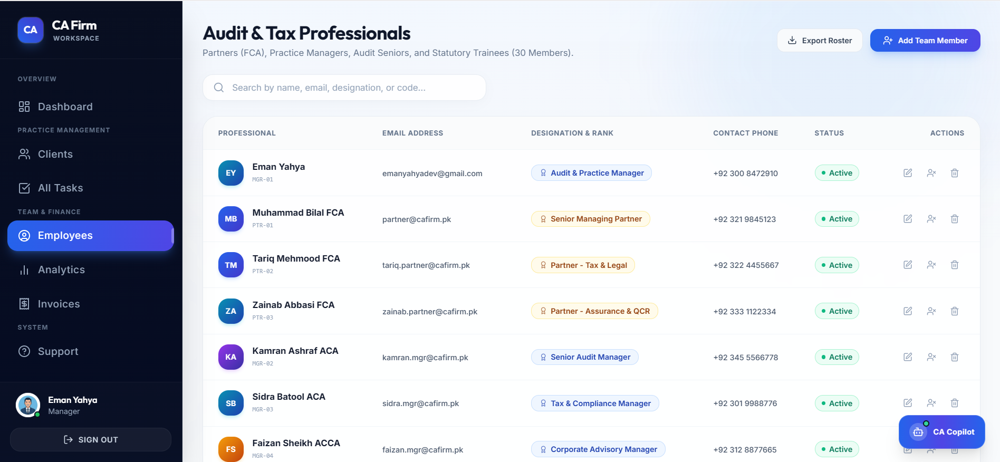

# Chartered Accountancy Practice Management System (CAP-OS)

<div align="center">
  
</div>

> An enterprise practice operating system engineered for audit firms, corporate tax advisories, and chartered accountancy practices. Features autonomous compliance workflows, statutory deadline scheduling, multi-tier engagement tracking, financial billing management, and real-time AI tool calling.

---

## Table of Contents

- [Executive Summary](#executive-summary)
- [System Architecture](#system-architecture)
  - [1. High-Level Modular Flow](#1-high-level-modular-flow)
  - [2. Autonomous Agent Execution Pipeline](#2-autonomous-agent-execution-pipeline)
  - [3. Entity-Relationship Data Model](#3-entity-relationship-data-model)
  - [4. Role-Based Access Control Hierarchy](#4-role-based-access-control-hierarchy)
- [Core Operational Modules](#core-operational-modules)
  - [Practice Analytics and KPI Cockpit](#practice-analytics-and-kpi-cockpit)
  - [Corporate Client Registry](#corporate-client-registry)
  - [Statutory Compliance and Task Management](#statutory-compliance-and-task-management)
  - [Financial Billing and Fee Note Ledger](#financial-billing-and-fee-note-ledger)
  - [Human Resources and Staff Productivity Matrix](#human-resources-and-staff-productivity-matrix)
  - [Autonomous AI Practice Copilot](#autonomous-ai-practice-copilot)
- [Regulatory Framework and Alignment](#regulatory-framework-and-alignment)
- [Technology Stack](#technology-stack)
- [Repository Structure](#repository-structure)
- [Installation and Quickstart](#installation-and-quickstart)
- [Environment Configuration](#environment-configuration)
- [API and Tool Calling Reference](#api-and-tool-calling-reference)
- [License and Governance](#license-and-governance)

---

## Executive Summary

The **Chartered Accountancy Practice Management System (CAP-OS)** is an integrated practice management platform designed specifically for the operational, compliance, and regulatory workflows of accounting and audit firms.

Modern chartered accountancy practices face operational bottlenecks managing concurrent statutory deadlines across corporate registries, revenue authorities, and assurance mandates. CAP-OS solves these challenges by combining:

1. **Centralized Compliance Governance**: Automated monitoring of statutory return deadlines (FBR Income Tax, Sales Tax, SECP Corporate Filings, PRA/SRB Provincial Services Tax).
2. **Engagement and Audit Tracking**: Workpaper assignment, partner review workflows, and milestone tracking aligned with International Standards on Auditing (ISA).
3. **Billing and Realization Management**: Retainer fee generation, automated invoicing, outstanding ledger tracking, and payment reconciliations in local currency (PKR).
4. **Autonomous AI Tool Calling**: Natural language workflow execution that modifies client registries, schedules tasks, issues fee notes, and exports analytical reports without manual form entry.

---

## System Architecture

### 1. High-Level Modular Flow

The architecture decouples presentation, local reactive state management, background server orchestration, and persistent storage layers:



---

### 2. Autonomous Agent Execution Pipeline

The AI Copilot operates through a resilient dual-layer architecture supporting direct inference and backend execution:



---

### 3. Entity-Relationship Data Model



---

### 4. Role-Based Access Control Hierarchy



---

## Core Operational Modules

### Practice Analytics and KPI Cockpit

The executive analytics dashboard aggregates real-time practice vitals across clients, open compliance matters, high-priority mandates, and monthly revenue metrics.

<div align="center">
  
</div>

- **Real-Time Vitals**: Global tracking of active corporate mandates, open tasks, critical deadlines, and gross fee billings.
- **Priority and Risk Distribution Index**: Segregation of high, medium, and standard compliance obligations.
- **Visual Completion Radians**: Live visualization of completed, in-progress, and pending client deliverables.

---

### Corporate Client Registry

Comprehensive repository for managing Pakistani corporate entities, tax registrations, and corporate governance records.

<div align="center">
  
</div>

- **Tax Identifier Verification**: Systematic cataloging of National Tax Numbers (NTN) and Sales Tax Registration Numbers (STRN).
- **Contact Management**: Designation, email, and direct telephone records of authorized directors, CFOs, and tax leads.
- **Engagement History**: Cross-linked records of all statutory filings and audits associated with each entity.

---

### Statutory Compliance and Task Management

Centralized statutory tracking system tailored for FBR tax returns, SECP corporate filings, and external audit mandates.

<div align="center">
  
</div>

- **Statutory Return Workflows**: Pre-configured procedures for FBR Sales Tax (Annexure-C), Income Tax Returns (Section 114), and Withholding Statements (Section 165).
- **Corporate Registry Filings**: Support for SECP Form A, Form 29, and authorized capital increments.
- **Assignment Matrix**: Direct allocation of mandates to individual audit seniors and multidisciplinary teams.

---

### Financial Billing and Fee Note Ledger

Practice accounting interface for issuing retainer invoices, tracking fee realization, and monitoring outstanding receivables.

<div align="center">
  
</div>

- **Fee Note Generation**: Automated drafting and dispatch of professional billing notes with auto-generated reference identifiers.
- **Settlement Tracking**: Recording of bank wire transfers (1LINK / RTGS / IBFT), corporate cheque deposits, and withholding tax adjustments.
- **Financial Status Metrics**: Segregated categorization of Sent, Paid, Draft, and Overdue receivables.

---

### Human Resources and Staff Productivity Matrix

Human resource and workload distribution system monitoring capacity, active client mandates, and team throughput.

<div align="center">
  
</div>

<div align="center">
  
</div>

- **Credential Rosters**: Practice directory classifying partners (FCA), managers (ACA/ACCA), supervisors, and audit associates.
- **Utilization Telemetry**: Calculation of active mandates per staff member and milestone completion ratios.

---

### Autonomous AI Practice Copilot

Interactive conversational agent powered by large language models with real-time tool calling capabilities for practice operations.

<div align="center">
  
</div>

- **Live Tool Calling**: Natural language parsing that executes direct mutations in the client registry, compliance queues, and billing systems.
- **Instant Report Exports**: Compilation and automatic browser download of CSV datasets for clients, tasks, rosters, and daily practice snapshots.
- **Regulatory Guidance**: Automated advisory support for statutory timelines, ICAP quality control guidelines, and tax ordinance clauses.

#### Autonomous Tool Calling Execution Samples

| Client Registration Action | Statutory Task Creation Action |
| :---: | :---: |
|  |  |

| Staff Provisioning Action | Client Lifecycle Action |
| :---: | :---: |
|  |  |

---

## Regulatory Framework and Alignment

CAP-OS is structured around statutory standards and legal frameworks:

| Jurisdiction / Body | Legislative & Statutory Alignment |
| :--- | :--- |
| **Federal Board of Revenue (FBR)** | Income Tax Ordinance 2001, Sales Tax Act 1990, Federal Excise Act 2005 |
| **Securities and Exchange Commission (SECP)** | Companies Act 2017, Listed Companies Code of Corporate Governance |
| **Provincial Revenue Authorities** | PRA (Punjab), SRB (Sindh), KPRA (Khyber Pakhtunkhwa), BRA (Balochistan) |
| **Auditing & Accounting Standards** | International Standards on Auditing (ISA), IFRS for SMEs, ICAP QCR Guidelines |

---

## Technology Stack

| Layer | Component | Description |
| :--- | :--- | :--- |
| **Frontend Framework** | React 18 / TypeScript | Type-safe declarative user interface |
| **Build & Bundler** | Vite 7 | High-performance Hot Module Replacement and production bundling |
| **Styling & Design System** | Tailwind CSS / shadcn/ui | Tailored executive slate and navy design system |
| **Iconography** | Lucide React | Clean corporate vector iconography |
| **Backend Service** | Node.js / Express | Local API router and asynchronous tool execution server |
| **AI Inference** | NVIDIA NIM API | Low-latency inference supporting `deepseek-v4.1-flash` and `gpt-oss-20b` |
| **Database & Auth** | Supabase / PostgreSQL | Persistent relational database with row-level security |
| **Client Storage** | LocalStorage Event Bus | Zero-latency reactive mock store for local development |

---

## Repository Structure

```bash
cap-os/
├── src/
│   ├── components/
│   │   ├── ca/ui/           # Reusable enterprise UI components (Cards, Tables, Modals)
│   │   ├── chat/            # Autonomous AI Copilot widget and settings modal
│   │   └── ui/              # Base shadcn component primitives
│   ├── hooks/               # Custom React hooks (toast, notifications, mobile detection)
│   ├── integrations/        # Supabase API clients and schema bindings
│   ├── pages/               # Primary platform route views
│   │   ├── Dashboard.tsx    # Executive KPI summary and risk allocation view
│   │   ├── Clients.tsx      # Corporate client registry and profile editor
│   │   ├── Tasks.tsx        # Compliance board and statutory deadline scheduler
│   │   ├── Invoices.tsx     # Billing notes and payment settlement registry
│   │   ├── Employees.tsx    # Staff roster and professional credential directory
│   │   ├── EmployeeProgress.tsx # Productivity telemetry and workload matrix
│   │   └── Login.tsx        # Single sign-on and role-based portal login
│   ├── services/
│   │   ├── api.ts           # Unified data access and persistence abstraction layer
│   │   └── mockDataStore.ts # Comprehensive in-memory reactive database
│   ├── types/               # TypeScript interfaces, schemas, and enums
│   ├── App.tsx              # Root application router and layout shell
│   ├── main.tsx             # Application bootstrap entrypoint
│   └── index.css            # Base stylesheet, design tokens, and scrollbar rules
├── public/                  # Static web assets and brand emblems
├── local_agent_server.js    # Node.js backend server handling tool calling and inference
├── .env.example             # Template environment configuration variables
├── index.html               # Main HTML5 entry document
├── package.json             # Project dependencies and script declarations
├── tailwind.config.ts       # Design system tokens, typography, and theme extensions
├── tsconfig.json            # TypeScript compiler configuration
└── vite.config.ts           # Vite bundler configuration
```

---

## Installation and Quickstart

### Prerequisites
- **Node.js**: Version 18.18.0 or higher (Node.js 20 LTS recommended)
- **npm** / **yarn** / **pnpm**
- **Git**

### Installation Steps

1. Clone the repository:
   ```bash
   git clone https://github.com/your-organization/cap-os.git
   cd cap-os
   ```

2. Install dependencies:
   ```bash
   npm install
   ```

3. Configure environment variables:
   ```bash
   cp .env.example .env
   ```

4. Launch the local development server:
   ```bash
   npm run dev
   ```

5. Launch the AI Agent backend service (in a separate terminal window):
   ```bash
   node local_agent_server.js
   ```

6. Open the application:
   Navigate to `http://localhost:8080` in your web browser.

---

## Environment Configuration

Populate your `.env` file with the relevant service keys:

```env
# Supabase Relational Database
VITE_SUPABASE_PROJECT_ID="your-project-id"
VITE_SUPABASE_PUBLISHABLE_KEY="your-supabase-publishable-key"
VITE_SUPABASE_URL="https://your-project-id.supabase.co"

# AI Inference Engine (NVIDIA NIM)
NVIDIA_API_KEY="nvapi-your-api-key"
VITE_NVIDIA_API_KEY="nvapi-your-api-key"
NVIDIA_MODEL="deepseek-ai/deepseek-v4.1-flash"
NVIDIA_API_URL="https://integrate.api.nvidia.com/v1/chat/completions"
```

---

## API and Tool Calling Reference

The backend exposes an asynchronous `/chat` endpoint supporting structured function execution:

### `POST /chat`

- **Headers**:
  ```http
  Content-Type: application/json
  x-nvidia-api-key: nvapi-... (Optional if defined in server env)
  ```

- **Request Body**:
  ```json
  {
    "message": "Create task SECP Form 29 Annual Return Filing for Apex Logistics",
    "history": []
  }
  ```

- **Response Payload**:
  ```json
  {
    "reply": "Statutory Task 'SECP Form 29 Annual Return Filing' created for Apex Logistics.",
    "action": "createTask",
    "params": {
      "title": "SECP Form 29 Annual Return Filing",
      "client": "Apex Logistics",
      "priority": "High"
    },
    "result": {
      "success": true,
      "action": "createTask",
      "data": { ... }
    }
  }
  ```

### Supported Autonomous Functions:
- `createClient(params)`: Registers corporate entities with auto-generated client codes and NTN/STRN.
- `deleteClient(params)`: Purges client records and linked dependencies.
- `createTask(params)`: Assigns compliance tasks with SLA deadlines and priority ratings.
- `updateTask(params)`: Changes status to Completed, In Progress, or Waiting for Client.
- `deleteTask(params)`: Removes mandates from the compliance board.
- `createEmployee(params)`: Registers professional staff with designation and system codes.
- `createInvoice(params)`: Issues professional fee notes in PKR with due dates.
- `exportReport(params)`: Compiles and triggers immediate CSV downloads for tasks, clients, or summaries.

---

## License and Governance

Distributed under the **MIT License**. See `LICENSE` for further details.

Engineered with precision for professional chartered accountancy firms, corporate registries, and statutory assurance practices.
